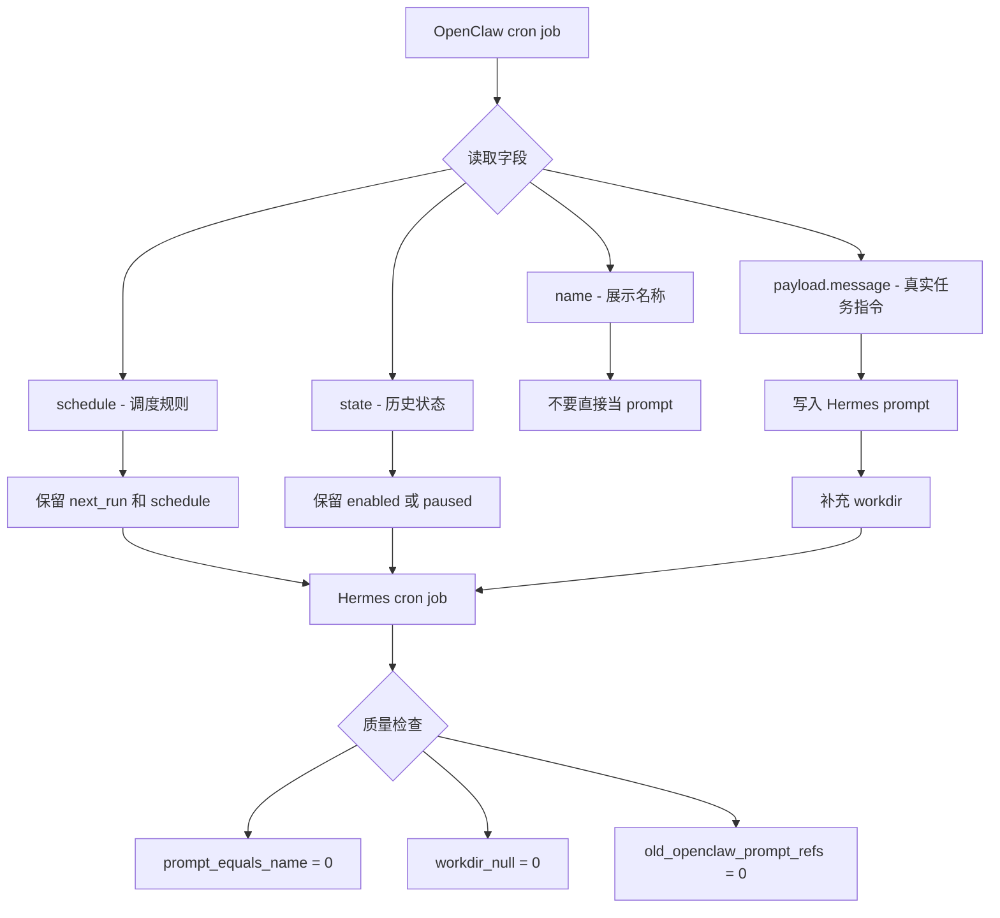
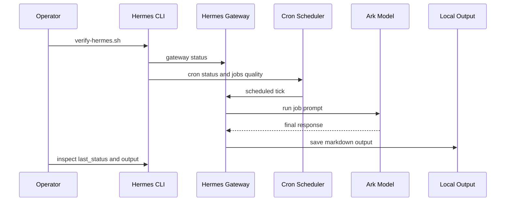

# Hermes 本地智能体实践手册

一套把 OpenClaw 迁移到 Hermes Agent 的本机实践沉淀：模型接入、开机自启、cron 迁移、任务修复、验证脚本和安全边界。

这个仓库是实践手册，不是 Hermes Agent 源码镜像；它不包含私有配置、密钥、聊天记录或可直接外发消息的平台凭据。

## TL;DR

如果你已经有 OpenClaw，并希望迁移到 Hermes，重点不是“把 cron 名字搬过去”，而是恢复每个任务的真实执行指令和工作目录：

```text
OpenClaw payload.message  ->  Hermes cron prompt
OpenClaw workspace        ->  Hermes cron workdir
Hermes launchd gateway    ->  开机自启 + 自动执行 cron
Hermes deliver=local      ->  本机保存输出，避免未配置消息平台时投递失败
```

最小验证路径：

```bash
./scripts/verify-hermes.sh
python3 scripts/optimize-cron-from-openclaw.py
python3 scripts/optimize-cron-from-openclaw.py --apply
```

## 目录

- [适用场景](#适用场景)
- [实践成果](#实践成果)
- [图示](#图示)
- [核心问题](#核心问题)
- [快速开始](#快速开始)
- [迁移流程](#迁移流程)
- [脚本说明](#脚本说明)
- [文档导航](#文档导航)
- [常见路径](#常见路径)
- [安全边界](#安全边界)
- [仓库定位](#仓库定位)

## 适用场景

这个仓库适合：

- 从 OpenClaw 迁移到 Hermes 的个人或团队
- 想在 macOS 上用 launchd 托管 Hermes gateway 的用户
- 想用 Hermes 跑本地 cron 定时任务的人
- 想接入火山引擎 Ark 或其他 OpenAI-compatible provider 的人
- 遇到 Hermes cron “任务成功但结果偏题”的人
- 想把本机 agent 实践整理成可分享资产的人

## 实践成果

本次实践已经跑通：

| 能力 | 状态 |
| --- | --- |
| Hermes CLI | 已验证 |
| Ark custom provider | 已验证 |
| `hermes -z` 模型连通 | 已验证 |
| macOS launchd 开机自启 | 已验证 |
| Hermes gateway 托管 cron | 已验证 |
| OpenClaw cron 迁移 | 已验证 |
| cron prompt 恢复 | 已验证 |
| cron workdir 补全 | 已验证 |
| OpenClaw gateway 停用 | 已验证 |
| 本机安全扫描 | 已验证 |

优化后的 cron 数据质量应接近：

```text
prompt_equals_name: 0
empty_prompt: 0
workdir_null: 0
old_openclaw_prompt_refs: 0
```

## 图示

### 迁移总览


### Cron 数据修复



### 运行验证闭环



## 核心问题

OpenClaw cron 源数据里，任务标题和真实指令是两个字段：

```text
name             -> 展示名称
payload.message  -> 真实任务指令
```

如果迁移时把 `name` 当成 Hermes 的 `prompt`，Hermes 只能靠标题猜任务。结果通常表现为：

- cron 可以触发
- LLM 可以返回
- `last_status` 可能是 `ok`
- 但输出和原任务目标不匹配

修复方式是从 OpenClaw cron 源文件恢复：

```text
$HOME/.openclaw/cron/jobs.json.migrated
```

并写入 Hermes：

```text
$HOME/.hermes/cron/jobs.json
```

## 快速开始

只读检查 Hermes 当前状态：

```bash
./scripts/verify-hermes.sh
```

检查项包括：

- Hermes CLI 和版本
- LLM 连通性
- gateway / launchd 状态
- cron scheduler 心跳
- cron 任务数量
- prompt / workdir 数据质量
- 迁移后真实执行记录
- OpenClaw gateway 是否仍在运行

从 OpenClaw cron 恢复 Hermes prompt 和 workdir，先 dry-run：

```bash
python3 scripts/optimize-cron-from-openclaw.py
```

确认输出后写入：

```bash
python3 scripts/optimize-cron-from-openclaw.py --apply
```

## 迁移流程

推荐按这个顺序做：

1. 安装 Hermes Agent。
2. 配置 Ark 或其他 custom provider。
3. 用 `hermes -z '只回复 OK'` 验证模型连通。
4. 安装并启动 Hermes gateway。
5. 执行 OpenClaw 官方迁移。
6. 复制或映射 OpenClaw workspace。
7. 检查 Hermes cron 数据质量。
8. 恢复完整 prompt 和 workdir。
9. 停用 OpenClaw gateway，避免双跑。
10. 等下一轮真实 cron 执行后检查输出。

关键命令：

```bash
hermes gateway install --force
hermes gateway start
hermes gateway status --full
hermes cron status
```

## 脚本说明

| 脚本 | 用途 | 是否写入 |
| --- | --- | --- |
| [`scripts/verify-hermes.sh`](scripts/verify-hermes.sh) | 检查 Hermes、gateway、cron 和任务数据质量 | 否 |
| [`scripts/optimize-cron-from-openclaw.py`](scripts/optimize-cron-from-openclaw.py) | 从 OpenClaw cron 恢复 Hermes prompt/workdir | 默认否，传 `--apply` 才写入 |

`optimize-cron-from-openclaw.py` 的默认行为是 dry-run。只有传入 `--apply` 时才会更新 Hermes cron 数据。

## 文档导航

| 文档 | 内容 |
| --- | --- |
| [安装与 Ark Provider](docs/01-install-and-provider.md) | Hermes 安装路径、Ark custom provider 配置、模型连通性验证 |
| [OpenClaw 迁移](docs/02-openclaw-migration.md) | 备份、官方迁移命令、cron 源数据结构、workspace 迁移 |
| [launchd 与 Cron](docs/03-launchd-cron.md) | gateway 安装、开机自启、cron 状态、OpenClaw 停用 |
| [Cron 任务优化](docs/04-cron-optimization.md) | prompt 恢复、workdir 映射、安全审批策略 |
| [验证清单](docs/05-verification-checklist.md) | CLI、模型、gateway、cron、输出、数据质量检查命令 |

## 常见路径

这些是常见默认路径，实际使用时按自己的机器调整：

```text
$HOME/.hermes/hermes-agent
$HOME/.hermes/config.yaml
$HOME/.hermes/.env
$HOME/.hermes/cron/jobs.json
$HOME/.hermes/cron/output/
$HOME/.openclaw/cron/jobs.json.migrated
$HOME/.openclaw/workspace/
```

## 安全边界

这个仓库刻意不保存：

- API key
- GitHub token
- Telegram / Discord / Slack token
- 完整私有日志
- 个人聊天上下文
- 可直接外发消息的平台凭据

文档中的 provider 名称、model 名称、目录结构和命令是实践信息，不包含可用密钥。

涉及 cron 自动执行时，尤其要谨慎处理：

- `curl` / 外部网络请求
- GitHub Issue / PR 创建或评论
- 写文件、提交、推送
- 全局自动审批

建议优先通过明确 prompt、正确 workdir 和可审计脚本提升稳定性，不要默认打开高风险的全局自动审批。

## 仓库定位

这是一个实践仓库，提供：

- 迁移过程记录
- 可复用检查脚本
- cron 修复脚本
- 验证清单
- 安全注意事项

它不提供：

- Hermes Agent 源码
- 私有环境配置
- 可直接复用的密钥或平台凭据
- 对所有 OpenClaw 数据结构的通用迁移保证

如果你要安装或升级 Hermes Agent，请使用 Hermes 官方仓库和官方安装方式；如果你要复用本次迁移经验，从本仓库的文档和脚本开始即可。
